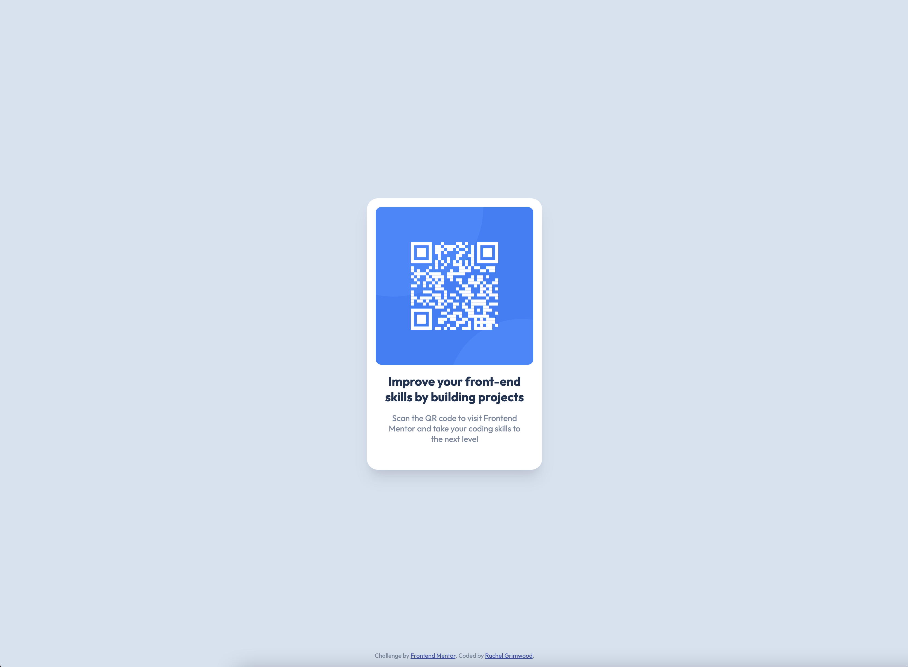

# Frontend Mentor - QR code component solution

This is a solution to the [QR code component challenge on Frontend Mentor](https://www.frontendmentor.io/challenges/qr-code-component-iux_sIO_H). Frontend Mentor challenges help you improve your coding skills by building realistic projects.

Feedback welcomed :)

## Table of contents

- [Screenshots](#screenshots)
- [Built with](#built-with)
- [What I learned](#what-i-learned)
- [Continued development](#continued-development)
- [Useful resources](#useful-resources)

## Screenshots

## Built with

- Semantic HTML5 markup
- CSS Custom Properties
- Flexbox
- Mobile-first workflow

## What I learned

This was a great quick CSS/flexbox refresher.
My aim was to make this design responsive with as little CSS as possible. (Setting both width and max-width helps with this.)

## Useful resources

- [Vertically centering a div](https://www.w3schools.com/howto/howto_css_center-vertical.asp)
- [CSS Custom Properties](https://developer.mozilla.org/en-US/docs/Web/CSS/Using_CSS_custom_properties)
- [Box shadows I copy paste a lot](https://getcssscan.com/css-box-shadow-examples)
